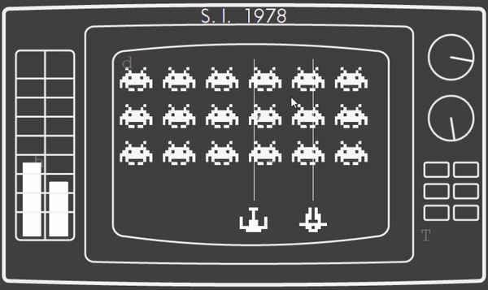
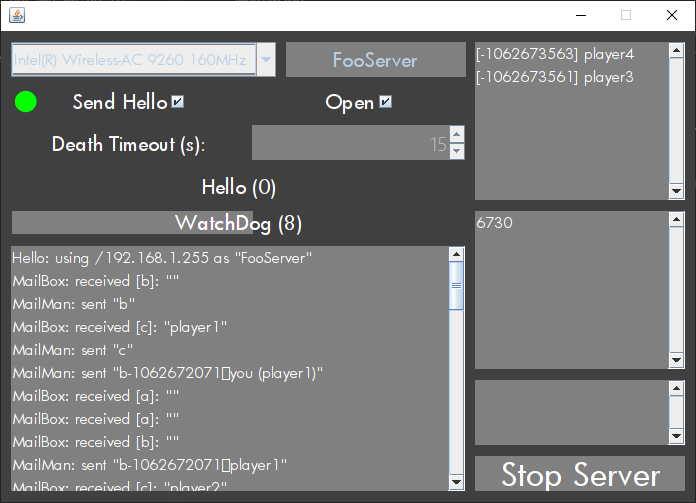
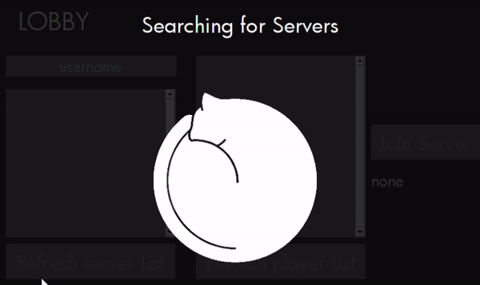

# Space Invaders 1978

  

## What's this?

It's a proof-of-concept lan multiplayer Space Invaders! It features a GUI Server and many animated GIFs, all rigorously using Swing's absolute layout.

This was originally a Java school project made in 2017, the development was rushed, my knowledge of the language was limited, and *interesting* design choices were made.

Fast forward to 2019-2020, my Uni OOP course used Java, which I had forgotten everything about. This became my go-to project to brush it up, by rewriting something everytime.

Interestingly, the last revision triggered a full project rewrite, in an attempt to move a bit further from the previous "programming as an art" approach, and added some fundamental features.

The original basic rules were maintained: no external dependencies and good ol' Swing UI. The development was made with the almighty Eclipse.

## The Server

*It is (and always will be) all Work in Progress.*

  

### Features

* **lobby and matchmaking!**\
  Players can register to a server and see eachother. A match starts when two player select eachother.
* **watchdogs!**\
  Dead clients and unresponsive matches are automatically purged after a configurable timeout.
* **server side pause!**\
  When a match pauses, the match thread itself goes in waiting state.
* **network interface selection!**\
  You can choose which NI to use. No virtual adapters stealing the spotlight!

## The Client

*Cute loading animation made by [Alejandro Mariscal](https://dribbble.com/aljdrom).*

  

### Features

* **fancy swing-powered graphics!**\
  100% Swing with a lot of GIFs

* **multiple clients on the same machine!**\
  Multiple clients can be ran on the same pc, under the same ip address. This makes testing a lot more comfortable.

* **swing timers powered animations!**\
  Animation use Swing timers, no thread spamming!

## New Features

* **multithreaded stability!**\
  Despite using many threads, the server can be toggled on and off quickly and safely. Running threads will terminate asynchronously.
* **proper real time gui updates!**\
  The gui is managed correctly through the EDT. Finally, Swing done right!

## Gradle Support

Thanks to [@razvanred99](https://github.com/razvanred99), who smoothed up my introduction to Gradle.\
Standalone runnable Jars were created with the [Shadow](https://imperceptiblethoughts.com/shadow/) Gradle plugin.

This is essential to set up a lightweight CI workflow.

## Download

Runnable jars are automatically built with GitHub Actions and are available here:\
<https://github.com/Lucide/SpaceInvaders1978/releases>
